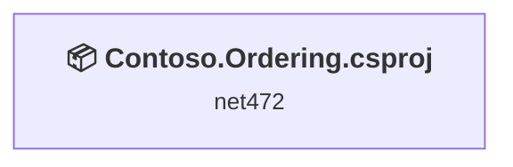
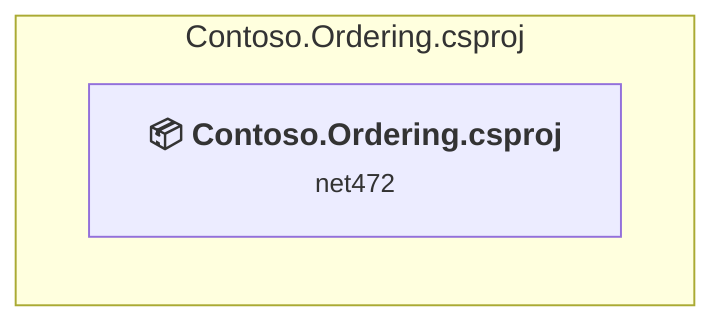

# Projects and dependencies analysis

This document provides a comprehensive overview of the projects and their dependencies in the context of upgrading to .NETCoreApp,Version=v10.0.

## Table of Contents

- [Executive Summary](#executive-Summary)
  - [Highlevel Metrics](#highlevel-metrics)
  - [Projects Compatibility](#projects-compatibility)
  - [Package Compatibility](#package-compatibility)
  - [API Compatibility](#api-compatibility)
  - [Binding Redirect Configuration](#binding-redirect-configuration)
- [Aggregate NuGet packages details](#aggregate-nuget-packages-details)
- [Top API Migration Challenges](#top-api-migration-challenges)
  - [Technologies and Features](#technologies-and-features)
  - [Most Frequent API Issues](#most-frequent-api-issues)
- [Projects Relationship Graph](#projects-relationship-graph)
- [Project Details](#project-details)

  - [Contoso.Ordering.csproj](#contosoorderingcsproj)

## Executive Summary

### Highlevel Metrics

| Metric | Count | Status |
| :--- | :---: | :--- |
| Total Projects | 1 | All require upgrade |
| Total NuGet Packages | 16 | 1 need upgrade |
| Total Code Files | 7 |  |
| Total Code Files with Incidents | 5 |  |
| Total Lines of Code | 731 |  |
| Total Number of Issues | 12 |  |
| Estimated LOC to modify | 10+ | at least 1.4% of codebase |

### Projects Compatibility

| Project | Target Framework | Difficulty | Test Coverage | Package Issues | API Issues | Binding Issues | Est. LOC Impact | Description |
| :--- | :---: | :---: | :---: | :---: | :---: | :---: | :---: | :--- |
| [Contoso.Ordering.csproj](#contosoorderingcsproj) | net472 | 🟢 Low | 🧪 Recommended | 1 | 10 | 0 | 10+ | DotNetCoreApp, Sdk Style = True |

🧪 **Test Coverage** — projects risky enough to add behavior-locking tests before upgrading, to catch regressions the upgrade may introduce. Requires the **dotnet-test** plugin.

### Package Compatibility

| Status | Count | Percentage |
| :--- | :---: | :---: |
| ✅ Compatible | 15 | 93.8% |
| ⚠️ Incompatible | 1 | 6.2% |
| 🔄 Upgrade Recommended | 0 | 0.0% |
| ***Total NuGet Packages*** | ***16*** | ***100%*** |

### API Compatibility

| Category | Count | Impact |
| :--- | :---: | :--- |
| 🔴 Binary Incompatible | 0 | High - Require code changes |
| 🟡 Source Incompatible | 9 | Medium - Needs re-compilation and potential conflicting API error fixing |
| 🔵 Behavioral change | 1 | Low - Behavioral changes that may require testing at runtime |
| ✅ Compatible | 767 |  |
| ***Total APIs Analyzed*** | ***777*** |  |

## Aggregate NuGet packages details

| Package | Current Version | Suggested Version | Projects | Description |
| :--- | :---: | :---: | :--- | :--- |
| Microsoft.Azure.Services.AppAuthentication | 1.4.0 |  | [Contoso.Ordering.csproj](#contosoorderingcsproj) | ✅Compatible |
| Microsoft.IdentityModel.Clients.ActiveDirectory | 5.2.0 |  | [Contoso.Ordering.csproj](#contosoorderingcsproj) | ✅Compatible |
| Microsoft.IdentityModel.JsonWebTokens | 6.7.1 |  | [Contoso.Ordering.csproj](#contosoorderingcsproj) | ✅Compatible |
| Microsoft.IdentityModel.Logging | 6.7.1 |  | [Contoso.Ordering.csproj](#contosoorderingcsproj) | ✅Compatible |
| Microsoft.IdentityModel.Tokens | 6.7.1 |  | [Contoso.Ordering.csproj](#contosoorderingcsproj) | ✅Compatible |
| Microsoft.Rest.ClientRuntime | 2.3.20 |  | [Contoso.Ordering.csproj](#contosoorderingcsproj) | ✅Compatible |
| Newtonsoft.Json | 10.0.3 |  | [Contoso.Ordering.csproj](#contosoorderingcsproj) | ✅Compatible |
| System.IdentityModel.Tokens.Jwt | 6.7.1 |  | [Contoso.Ordering.csproj](#contosoorderingcsproj) | ✅Compatible |
| System.IO | 4.3.0 |  | [Contoso.Ordering.csproj](#contosoorderingcsproj) | ✅Compatible |
| System.Net.Http | 4.3.4 |  | [Contoso.Ordering.csproj](#contosoorderingcsproj) | ✅Compatible |
| System.Runtime | 4.3.0 |  | [Contoso.Ordering.csproj](#contosoorderingcsproj) | ✅Compatible |
| System.Security.Cryptography.Algorithms | 4.3.0 |  | [Contoso.Ordering.csproj](#contosoorderingcsproj) | ✅Compatible |
| System.Security.Cryptography.Encoding | 4.3.0 |  | [Contoso.Ordering.csproj](#contosoorderingcsproj) | ✅Compatible |
| System.Security.Cryptography.Primitives | 4.3.0 |  | [Contoso.Ordering.csproj](#contosoorderingcsproj) | ✅Compatible |
| System.Security.Cryptography.X509Certificates | 4.3.0 |  | [Contoso.Ordering.csproj](#contosoorderingcsproj) | ✅Compatible |
| WindowsAzure.ServiceBus | 6.2.1 |  | [Contoso.Ordering.csproj](#contosoorderingcsproj) | ⚠️Replace with Azure.Messaging.ServiceBus: Use ServiceBusClient/Sender/Processor pattern |

## Top API Migration Challenges

### Technologies and Features

| Technology | Issues | Percentage | Migration Path |
| :--- | :---: | :---: | :--- |

### Most Frequent API Issues

| API | Count | Percentage | Category |
| :--- | :---: | :---: | :--- |
| M:System.TimeSpan.FromMinutes(System.Double) | 4 | 40.0% | Source Incompatible |
| M:System.TimeSpan.FromDays(System.Double) | 2 | 20.0% | Source Incompatible |
| M:System.TimeSpan.FromSeconds(System.Double) | 2 | 20.0% | Source Incompatible |
| M:System.TimeSpan.FromHours(System.Double) | 1 | 10.0% | Source Incompatible |
| T:System.Uri | 1 | 10.0% | Behavioral Change |

## Projects Relationship Graph

Legend:
📦 SDK-style project
⚙️ Classic project

## Project Details

### Contoso.Ordering.csproj

#### Project Info

- **Current Target Framework:** net472
- **Proposed Target Framework:** net10.0
- **SDK-style**: True
- **Project Kind:** DotNetCoreApp
- **Dependencies**: 0
- **Dependants**: 0
- **Number of Files**: 7
- **Number of Files with Incidents**: 5
- **Lines of Code**: 731
- **Estimated LOC to modify**: 10+ (at least 1.4% of the project)

#### Dependency Graph

Legend:
📦 SDK-style project
⚙️ Classic project

### API Compatibility

| Category | Count | Impact |
| :--- | :---: | :--- |
| 🔴 Binary Incompatible | 0 | High - Require code changes |
| 🟡 Source Incompatible | 9 | Medium - Needs re-compilation and potential conflicting API error fixing |
| 🔵 Behavioral change | 1 | Low - Behavioral changes that may require testing at runtime |
| ✅ Compatible | 767 |  |
| ***Total APIs Analyzed*** | ***777*** |  |

