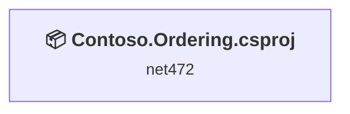
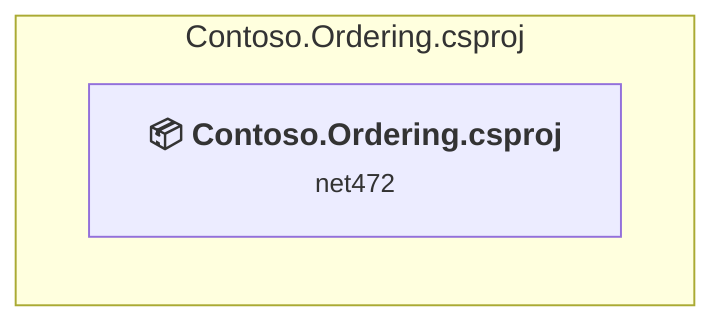

# Projects and dependencies analysis

This document provides a comprehensive overview of the projects and their dependencies in the context of upgrading to .NETCoreApp,Version=v10.0.

## Table of Contents

- [Executive Summary](#executive-Summary)
  - [Highlevel Metrics](#highlevel-metrics)
  - [Projects Compatibility](#projects-compatibility)
  - [Package Compatibility](#package-compatibility)
  - [API Compatibility](#api-compatibility)
  - [Binding Redirect Configuration](#binding-redirect-configuration)
- [Aggregate NuGet packages details](#aggregate-nuget-packages-details)
- [Top API Migration Challenges](#top-api-migration-challenges)
  - [Technologies and Features](#technologies-and-features)
  - [Most Frequent API Issues](#most-frequent-api-issues)
- [Projects Relationship Graph](#projects-relationship-graph)
- [Project Details](#project-details)

  - [Contoso.Ordering.csproj](#contosoorderingcsproj)

## Executive Summary

### Highlevel Metrics

| Metric | Count | Status |
| :--- | :---: | :--- |
| Total Projects | 1 | All require upgrade |
| Total NuGet Packages | 19 | All compatible |
| Total Code Files | 7 |  |
| Total Code Files with Incidents | 5 |  |
| Total Lines of Code | 731 |  |
| Total Number of Issues | 10 |  |
| Estimated LOC to modify | 9+ | at least 1.2% of codebase |

### Projects Compatibility

| Project | Target Framework | Difficulty | Test Coverage | Package Issues | API Issues | Binding Issues | Est. LOC Impact | Description |
| :--- | :---: | :---: | :---: | :---: | :---: | :---: | :---: | :--- |
| [Contoso.Ordering.csproj](#contosoorderingcsproj) | net472 | 🟢 Low | 🧪 Recommended | 0 | 9 | 0 | 9+ | DotNetCoreApp, Sdk Style = True |

🧪 **Test Coverage** — projects risky enough to add behavior-locking tests before upgrading, to catch regressions the upgrade may introduce. Requires the **dotnet-test** plugin.

### Package Compatibility

| Status | Count | Percentage |
| :--- | :---: | :---: |
| ✅ Compatible | 19 | 100.0% |
| ⚠️ Incompatible | 0 | 0.0% |
| 🔄 Upgrade Recommended | 0 | 0.0% |
| ***Total NuGet Packages*** | ***19*** | ***100%*** |

### API Compatibility

| Category | Count | Impact |
| :--- | :---: | :--- |
| 🔴 Binary Incompatible | 0 | High - Require code changes |
| 🟡 Source Incompatible | 9 | Medium - Needs re-compilation and potential conflicting API error fixing |
| 🔵 Behavioral change | 0 | Low - Behavioral changes that may require testing at runtime |
| ✅ Compatible | 343 |  |
| ***Total APIs Analyzed*** | ***352*** |  |

## Aggregate NuGet packages details

| Package | Current Version | Suggested Version | Projects | Description |
| :--- | :---: | :---: | :--- | :--- |
| Azure.Core | 1.60.0 |  | [Contoso.Ordering.csproj](#contosoorderingcsproj) | ✅Compatible |
| Azure.Core.Amqp | 1.3.1 |  | [Contoso.Ordering.csproj](#contosoorderingcsproj) | ✅Compatible |
| Azure.Messaging.ServiceBus | 7.20.2 |  | [Contoso.Ordering.csproj](#contosoorderingcsproj) | ✅Compatible |
| Microsoft.Azure.Amqp | 2.7.0 |  | [Contoso.Ordering.csproj](#contosoorderingcsproj) | ✅Compatible |
| Microsoft.Bcl.AsyncInterfaces | 10.0.9 |  | [Contoso.Ordering.csproj](#contosoorderingcsproj) | ✅Compatible |
| Microsoft.Extensions.Configuration.Abstractions | 10.0.9 |  | [Contoso.Ordering.csproj](#contosoorderingcsproj) | ✅Compatible |
| Microsoft.Extensions.DependencyInjection.Abstractions | 10.0.9 |  | [Contoso.Ordering.csproj](#contosoorderingcsproj) | ✅Compatible |
| Microsoft.Extensions.Diagnostics.Abstractions | 10.0.9 |  | [Contoso.Ordering.csproj](#contosoorderingcsproj) | ✅Compatible |
| Microsoft.Extensions.FileProviders.Abstractions | 10.0.9 |  | [Contoso.Ordering.csproj](#contosoorderingcsproj) | ✅Compatible |
| Microsoft.Extensions.Hosting.Abstractions | 10.0.9 |  | [Contoso.Ordering.csproj](#contosoorderingcsproj) | ✅Compatible |
| Microsoft.Extensions.Logging.Abstractions | 10.0.9 |  | [Contoso.Ordering.csproj](#contosoorderingcsproj) | ✅Compatible |
| Microsoft.Extensions.Options | 10.0.9 |  | [Contoso.Ordering.csproj](#contosoorderingcsproj) | ✅Compatible |
| Microsoft.Extensions.Primitives | 10.0.9 |  | [Contoso.Ordering.csproj](#contosoorderingcsproj) | ✅Compatible |
| Microsoft.Identity.Client | 4.84.2 |  | [Contoso.Ordering.csproj](#contosoorderingcsproj) | ✅Compatible |
| Microsoft.Identity.Client.Extensions.Msal | 4.84.2 |  | [Contoso.Ordering.csproj](#contosoorderingcsproj) | ✅Compatible |
| Microsoft.IdentityModel.Abstractions | 8.14.0 |  | [Contoso.Ordering.csproj](#contosoorderingcsproj) | ✅Compatible |
| System.ClientModel | 1.14.0 |  | [Contoso.Ordering.csproj](#contosoorderingcsproj) | ✅Compatible |
| System.Memory.Data | 10.0.9 |  | [Contoso.Ordering.csproj](#contosoorderingcsproj) | ✅Compatible |
| System.Security.Cryptography.ProtectedData | 4.5.0 |  | [Contoso.Ordering.csproj](#contosoorderingcsproj) | ✅Compatible |

## Top API Migration Challenges

### Technologies and Features

| Technology | Issues | Percentage | Migration Path |
| :--- | :---: | :---: | :--- |

### Most Frequent API Issues

| API | Count | Percentage | Category |
| :--- | :---: | :---: | :--- |
| M:System.TimeSpan.FromMinutes(System.Double) | 4 | 44.4% | Source Incompatible |
| M:System.TimeSpan.FromDays(System.Double) | 2 | 22.2% | Source Incompatible |
| M:System.TimeSpan.FromSeconds(System.Double) | 2 | 22.2% | Source Incompatible |
| M:System.TimeSpan.FromHours(System.Double) | 1 | 11.1% | Source Incompatible |

## Projects Relationship Graph

Legend:
📦 SDK-style project
⚙️ Classic project

## Project Details

### Contoso.Ordering.csproj

#### Project Info

- **Current Target Framework:** net472
- **Proposed Target Framework:** net10.0
- **SDK-style**: True
- **Project Kind:** DotNetCoreApp
- **Dependencies**: 0
- **Dependants**: 0
- **Number of Files**: 7
- **Number of Files with Incidents**: 5
- **Lines of Code**: 731
- **Estimated LOC to modify**: 9+ (at least 1.2% of the project)

#### Dependency Graph

Legend:
📦 SDK-style project
⚙️ Classic project

### API Compatibility

| Category | Count | Impact |
| :--- | :---: | :--- |
| 🔴 Binary Incompatible | 0 | High - Require code changes |
| 🟡 Source Incompatible | 9 | Medium - Needs re-compilation and potential conflicting API error fixing |
| 🔵 Behavioral change | 0 | Low - Behavioral changes that may require testing at runtime |
| ✅ Compatible | 343 |  |
| ***Total APIs Analyzed*** | ***352*** |  |

