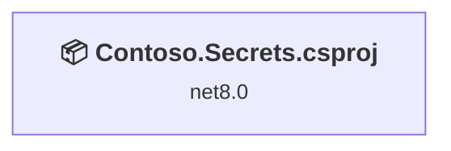
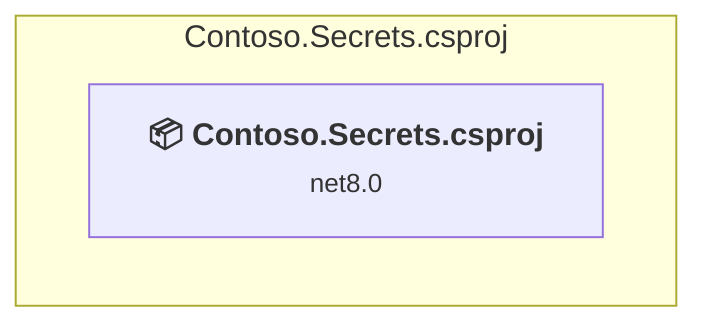

# Projects and dependencies analysis

This document provides a comprehensive overview of the projects and their dependencies in the context of upgrading to .NETCoreApp,Version=v10.0.

## Table of Contents

- [Executive Summary](#executive-Summary)
  - [Highlevel Metrics](#highlevel-metrics)
  - [Projects Compatibility](#projects-compatibility)
  - [Package Compatibility](#package-compatibility)
  - [API Compatibility](#api-compatibility)
  - [Binding Redirect Configuration](#binding-redirect-configuration)
- [Aggregate NuGet packages details](#aggregate-nuget-packages-details)
- [Top API Migration Challenges](#top-api-migration-challenges)
  - [Technologies and Features](#technologies-and-features)
  - [Most Frequent API Issues](#most-frequent-api-issues)
- [Projects Relationship Graph](#projects-relationship-graph)
- [Project Details](#project-details)

  - [Contoso.Secrets.csproj](#contososecretscsproj)

## Executive Summary

### Highlevel Metrics

| Metric | Count | Status |
| :--- | :---: | :--- |
| Total Projects | 1 | All require upgrade |
| Total NuGet Packages | 99 | All compatible |
| Total Code Files | 7 |  |
| Total Code Files with Incidents | 2 |  |
| Total Lines of Code | 703 |  |
| Total Number of Issues | 2 |  |
| Estimated LOC to modify | 1+ | at least 0.1% of codebase |

### Projects Compatibility

| Project | Target Framework | Difficulty | Test Coverage | Package Issues | API Issues | Binding Issues | Est. LOC Impact | Description |
| :--- | :---: | :---: | :---: | :---: | :---: | :---: | :---: | :--- |
| [Contoso.Secrets.csproj](#contososecretscsproj) | net8.0 | 🟢 Low | 🧪 Recommended | 0 | 1 | 0 | 1+ | DotNetCoreApp, Sdk Style = True |

🧪 **Test Coverage** — projects risky enough to add behavior-locking tests before upgrading, to catch regressions the upgrade may introduce. Requires the **dotnet-test** plugin.

### Package Compatibility

| Status | Count | Percentage |
| :--- | :---: | :---: |
| ✅ Compatible | 99 | 100.0% |
| ⚠️ Incompatible | 0 | 0.0% |
| 🔄 Upgrade Recommended | 0 | 0.0% |
| ***Total NuGet Packages*** | ***99*** | ***100%*** |

### API Compatibility

| Category | Count | Impact |
| :--- | :---: | :--- |
| 🔴 Binary Incompatible | 0 | High - Require code changes |
| 🟡 Source Incompatible | 0 | Medium - Needs re-compilation and potential conflicting API error fixing |
| 🔵 Behavioral change | 1 | Low - Behavioral changes that may require testing at runtime |
| ✅ Compatible | 784 |  |
| ***Total APIs Analyzed*** | ***785*** |  |

## Aggregate NuGet packages details

| Package | Current Version | Suggested Version | Projects | Description |
| :--- | :---: | :---: | :--- | :--- |
| Microsoft.Azure.KeyVault | 3.0.5 |  | [Contoso.Secrets.csproj](#contososecretscsproj) | ✅Compatible |
| Microsoft.Azure.KeyVault.WebKey | 3.0.5 |  | [Contoso.Secrets.csproj](#contososecretscsproj) | ✅Compatible |
| Microsoft.Azure.Services.AppAuthentication | 1.6.2 |  | [Contoso.Secrets.csproj](#contososecretscsproj) | ✅Compatible |
| Microsoft.CSharp | 4.3.0 |  | [Contoso.Secrets.csproj](#contososecretscsproj) | ✅Compatible |
| Microsoft.IdentityModel.Clients.ActiveDirectory | 5.2.9 |  | [Contoso.Secrets.csproj](#contososecretscsproj) | ✅Compatible |
| Microsoft.NETCore.Platforms | 1.1.1 |  | [Contoso.Secrets.csproj](#contososecretscsproj) | ✅Compatible |
| Microsoft.NETCore.Targets | 1.1.3 |  | [Contoso.Secrets.csproj](#contososecretscsproj) | ✅Compatible |
| Microsoft.Rest.ClientRuntime | 2.3.20 |  | [Contoso.Secrets.csproj](#contososecretscsproj) | ✅Compatible |
| Microsoft.Rest.ClientRuntime.Azure | 3.3.18 |  | [Contoso.Secrets.csproj](#contososecretscsproj) | ✅Compatible |
| Microsoft.Win32.Primitives | 4.3.0 |  | [Contoso.Secrets.csproj](#contososecretscsproj) | ✅Compatible |
| Microsoft.Win32.Registry | 4.3.0 |  | [Contoso.Secrets.csproj](#contososecretscsproj) | ✅Compatible |
| NETStandard.Library | 1.6.1 |  | [Contoso.Secrets.csproj](#contososecretscsproj) | ✅Compatible |
| Newtonsoft.Json | 10.0.3 |  | [Contoso.Secrets.csproj](#contososecretscsproj) | ✅Compatible |
| runtime.debian.8-x64.runtime.native.System.Security.Cryptography.OpenSsl | 4.3.2 |  | [Contoso.Secrets.csproj](#contososecretscsproj) | ✅Compatible |
| runtime.fedora.23-x64.runtime.native.System.Security.Cryptography.OpenSsl | 4.3.2 |  | [Contoso.Secrets.csproj](#contososecretscsproj) | ✅Compatible |
| runtime.fedora.24-x64.runtime.native.System.Security.Cryptography.OpenSsl | 4.3.2 |  | [Contoso.Secrets.csproj](#contososecretscsproj) | ✅Compatible |
| runtime.native.System | 4.3.0 |  | [Contoso.Secrets.csproj](#contososecretscsproj) | ✅Compatible |
| runtime.native.System.IO.Compression | 4.3.0 |  | [Contoso.Secrets.csproj](#contososecretscsproj) | ✅Compatible |
| runtime.native.System.Net.Http | 4.3.0 |  | [Contoso.Secrets.csproj](#contososecretscsproj) | ✅Compatible |
| runtime.native.System.Security.Cryptography.Apple | 4.3.0 |  | [Contoso.Secrets.csproj](#contososecretscsproj) | ✅Compatible |
| runtime.native.System.Security.Cryptography.OpenSsl | 4.3.2 |  | [Contoso.Secrets.csproj](#contososecretscsproj) | ✅Compatible |
| runtime.opensuse.13.2-x64.runtime.native.System.Security.Cryptography.OpenSsl | 4.3.2 |  | [Contoso.Secrets.csproj](#contososecretscsproj) | ✅Compatible |
| runtime.opensuse.42.1-x64.runtime.native.System.Security.Cryptography.OpenSsl | 4.3.2 |  | [Contoso.Secrets.csproj](#contososecretscsproj) | ✅Compatible |
| runtime.osx.10.10-x64.runtime.native.System.Security.Cryptography.Apple | 4.3.0 |  | [Contoso.Secrets.csproj](#contososecretscsproj) | ✅Compatible |
| runtime.osx.10.10-x64.runtime.native.System.Security.Cryptography.OpenSsl | 4.3.2 |  | [Contoso.Secrets.csproj](#contososecretscsproj) | ✅Compatible |
| runtime.rhel.7-x64.runtime.native.System.Security.Cryptography.OpenSsl | 4.3.2 |  | [Contoso.Secrets.csproj](#contososecretscsproj) | ✅Compatible |
| runtime.ubuntu.14.04-x64.runtime.native.System.Security.Cryptography.OpenSsl | 4.3.2 |  | [Contoso.Secrets.csproj](#contososecretscsproj) | ✅Compatible |
| runtime.ubuntu.16.04-x64.runtime.native.System.Security.Cryptography.OpenSsl | 4.3.2 |  | [Contoso.Secrets.csproj](#contososecretscsproj) | ✅Compatible |
| runtime.ubuntu.16.10-x64.runtime.native.System.Security.Cryptography.OpenSsl | 4.3.2 |  | [Contoso.Secrets.csproj](#contososecretscsproj) | ✅Compatible |
| System.AppContext | 4.3.0 |  | [Contoso.Secrets.csproj](#contososecretscsproj) | ✅Compatible |
| System.Buffers | 4.3.0 |  | [Contoso.Secrets.csproj](#contososecretscsproj) | ✅Compatible |
| System.Collections | 4.3.0 |  | [Contoso.Secrets.csproj](#contososecretscsproj) | ✅Compatible |
| System.Collections.Concurrent | 4.3.0 |  | [Contoso.Secrets.csproj](#contososecretscsproj) | ✅Compatible |
| System.Collections.NonGeneric | 4.3.0 |  | [Contoso.Secrets.csproj](#contososecretscsproj) | ✅Compatible |
| System.Collections.Specialized | 4.3.0 |  | [Contoso.Secrets.csproj](#contososecretscsproj) | ✅Compatible |
| System.ComponentModel | 4.3.0 |  | [Contoso.Secrets.csproj](#contososecretscsproj) | ✅Compatible |
| System.ComponentModel.Primitives | 4.3.0 |  | [Contoso.Secrets.csproj](#contososecretscsproj) | ✅Compatible |
| System.ComponentModel.TypeConverter | 4.3.0 |  | [Contoso.Secrets.csproj](#contososecretscsproj) | ✅Compatible |
| System.Console | 4.3.0 |  | [Contoso.Secrets.csproj](#contososecretscsproj) | ✅Compatible |
| System.Diagnostics.Debug | 4.3.0 |  | [Contoso.Secrets.csproj](#contososecretscsproj) | ✅Compatible |
| System.Diagnostics.DiagnosticSource | 4.3.0 |  | [Contoso.Secrets.csproj](#contososecretscsproj) | ✅Compatible |
| System.Diagnostics.Process | 4.3.0 |  | [Contoso.Secrets.csproj](#contososecretscsproj) | ✅Compatible |
| System.Diagnostics.Tools | 4.3.0 |  | [Contoso.Secrets.csproj](#contososecretscsproj) | ✅Compatible |
| System.Diagnostics.Tracing | 4.3.0 |  | [Contoso.Secrets.csproj](#contososecretscsproj) | ✅Compatible |
| System.Dynamic.Runtime | 4.3.0 |  | [Contoso.Secrets.csproj](#contososecretscsproj) | ✅Compatible |
| System.Globalization | 4.3.0 |  | [Contoso.Secrets.csproj](#contososecretscsproj) | ✅Compatible |
| System.Globalization.Calendars | 4.3.0 |  | [Contoso.Secrets.csproj](#contososecretscsproj) | ✅Compatible |
| System.Globalization.Extensions | 4.3.0 |  | [Contoso.Secrets.csproj](#contososecretscsproj) | ✅Compatible |
| System.IO | 4.3.0 |  | [Contoso.Secrets.csproj](#contososecretscsproj) | ✅Compatible |
| System.IO.Compression | 4.3.0 |  | [Contoso.Secrets.csproj](#contososecretscsproj) | ✅Compatible |
| System.IO.Compression.ZipFile | 4.3.0 |  | [Contoso.Secrets.csproj](#contososecretscsproj) | ✅Compatible |
| System.IO.FileSystem | 4.3.0 |  | [Contoso.Secrets.csproj](#contososecretscsproj) | ✅Compatible |
| System.IO.FileSystem.Primitives | 4.3.0 |  | [Contoso.Secrets.csproj](#contososecretscsproj) | ✅Compatible |
| System.Linq | 4.3.0 |  | [Contoso.Secrets.csproj](#contososecretscsproj) | ✅Compatible |
| System.Linq.Expressions | 4.3.0 |  | [Contoso.Secrets.csproj](#contososecretscsproj) | ✅Compatible |
| System.Net.Http | 4.3.4 |  | [Contoso.Secrets.csproj](#contososecretscsproj) | ✅Compatible |
| System.Net.Primitives | 4.3.0 |  | [Contoso.Secrets.csproj](#contososecretscsproj) | ✅Compatible |
| System.Net.Sockets | 4.3.0 |  | [Contoso.Secrets.csproj](#contososecretscsproj) | ✅Compatible |
| System.ObjectModel | 4.3.0 |  | [Contoso.Secrets.csproj](#contososecretscsproj) | ✅Compatible |
| System.Private.DataContractSerialization | 4.3.0 |  | [Contoso.Secrets.csproj](#contososecretscsproj) | ✅Compatible |
| System.Private.Uri | 4.3.2 |  | [Contoso.Secrets.csproj](#contososecretscsproj) | ✅Compatible |
| System.Reflection | 4.3.0 |  | [Contoso.Secrets.csproj](#contososecretscsproj) | ✅Compatible |
| System.Reflection.Emit | 4.3.0 |  | [Contoso.Secrets.csproj](#contososecretscsproj) | ✅Compatible |
| System.Reflection.Emit.ILGeneration | 4.3.0 |  | [Contoso.Secrets.csproj](#contososecretscsproj) | ✅Compatible |
| System.Reflection.Emit.Lightweight | 4.3.0 |  | [Contoso.Secrets.csproj](#contososecretscsproj) | ✅Compatible |
| System.Reflection.Extensions | 4.3.0 |  | [Contoso.Secrets.csproj](#contososecretscsproj) | ✅Compatible |
| System.Reflection.Primitives | 4.3.0 |  | [Contoso.Secrets.csproj](#contososecretscsproj) | ✅Compatible |
| System.Reflection.TypeExtensions | 4.3.0 |  | [Contoso.Secrets.csproj](#contososecretscsproj) | ✅Compatible |
| System.Resources.ResourceManager | 4.3.0 |  | [Contoso.Secrets.csproj](#contososecretscsproj) | ✅Compatible |
| System.Runtime | 4.3.0 |  | [Contoso.Secrets.csproj](#contososecretscsproj) | ✅Compatible |
| System.Runtime.Extensions | 4.3.0 |  | [Contoso.Secrets.csproj](#contososecretscsproj) | ✅Compatible |
| System.Runtime.Handles | 4.3.0 |  | [Contoso.Secrets.csproj](#contososecretscsproj) | ✅Compatible |
| System.Runtime.InteropServices | 4.3.0 |  | [Contoso.Secrets.csproj](#contososecretscsproj) | ✅Compatible |
| System.Runtime.InteropServices.RuntimeInformation | 4.3.0 |  | [Contoso.Secrets.csproj](#contososecretscsproj) | ✅Compatible |
| System.Runtime.Numerics | 4.3.0 |  | [Contoso.Secrets.csproj](#contososecretscsproj) | ✅Compatible |
| System.Runtime.Serialization.Formatters | 4.3.0 |  | [Contoso.Secrets.csproj](#contososecretscsproj) | ✅Compatible |
| System.Runtime.Serialization.Json | 4.3.0 |  | [Contoso.Secrets.csproj](#contososecretscsproj) | ✅Compatible |
| System.Runtime.Serialization.Primitives | 4.3.0 |  | [Contoso.Secrets.csproj](#contososecretscsproj) | ✅Compatible |
| System.Security.Cryptography.Algorithms | 4.3.0 |  | [Contoso.Secrets.csproj](#contososecretscsproj) | ✅Compatible |
| System.Security.Cryptography.Cng | 4.3.0 |  | [Contoso.Secrets.csproj](#contososecretscsproj) | ✅Compatible |
| System.Security.Cryptography.Csp | 4.3.0 |  | [Contoso.Secrets.csproj](#contososecretscsproj) | ✅Compatible |
| System.Security.Cryptography.Encoding | 4.3.0 |  | [Contoso.Secrets.csproj](#contososecretscsproj) | ✅Compatible |
| System.Security.Cryptography.OpenSsl | 4.3.0 |  | [Contoso.Secrets.csproj](#contososecretscsproj) | ✅Compatible |
| System.Security.Cryptography.Primitives | 4.3.0 |  | [Contoso.Secrets.csproj](#contososecretscsproj) | ✅Compatible |
| System.Security.Cryptography.X509Certificates | 4.3.0 |  | [Contoso.Secrets.csproj](#contososecretscsproj) | ✅Compatible |
| System.Security.SecureString | 4.3.0 |  | [Contoso.Secrets.csproj](#contososecretscsproj) | ✅Compatible |
| System.Text.Encoding | 4.3.0 |  | [Contoso.Secrets.csproj](#contososecretscsproj) | ✅Compatible |
| System.Text.Encoding.Extensions | 4.3.0 |  | [Contoso.Secrets.csproj](#contososecretscsproj) | ✅Compatible |
| System.Text.RegularExpressions | 4.3.0 |  | [Contoso.Secrets.csproj](#contososecretscsproj) | ✅Compatible |
| System.Threading | 4.3.0 |  | [Contoso.Secrets.csproj](#contososecretscsproj) | ✅Compatible |
| System.Threading.Tasks | 4.3.0 |  | [Contoso.Secrets.csproj](#contososecretscsproj) | ✅Compatible |
| System.Threading.Tasks.Extensions | 4.3.0 |  | [Contoso.Secrets.csproj](#contososecretscsproj) | ✅Compatible |
| System.Threading.Thread | 4.3.0 |  | [Contoso.Secrets.csproj](#contososecretscsproj) | ✅Compatible |
| System.Threading.ThreadPool | 4.3.0 |  | [Contoso.Secrets.csproj](#contososecretscsproj) | ✅Compatible |
| System.Threading.Timer | 4.3.0 |  | [Contoso.Secrets.csproj](#contososecretscsproj) | ✅Compatible |
| System.Xml.ReaderWriter | 4.3.0 |  | [Contoso.Secrets.csproj](#contososecretscsproj) | ✅Compatible |
| System.Xml.XDocument | 4.3.0 |  | [Contoso.Secrets.csproj](#contososecretscsproj) | ✅Compatible |
| System.Xml.XmlDocument | 4.3.0 |  | [Contoso.Secrets.csproj](#contososecretscsproj) | ✅Compatible |
| System.Xml.XmlSerializer | 4.3.0 |  | [Contoso.Secrets.csproj](#contososecretscsproj) | ✅Compatible |

## Top API Migration Challenges

### Technologies and Features

| Technology | Issues | Percentage | Migration Path |
| :--- | :---: | :---: | :--- |

### Most Frequent API Issues

| API | Count | Percentage | Category |
| :--- | :---: | :---: | :--- |
| T:System.Net.Http.HttpContent | 1 | 100.0% | Behavioral Change |

## Projects Relationship Graph

Legend:
📦 SDK-style project
⚙️ Classic project

## Project Details

### Contoso.Secrets.csproj

#### Project Info

- **Current Target Framework:** net8.0
- **Proposed Target Framework:** net10.0
- **SDK-style**: True
- **Project Kind:** DotNetCoreApp
- **Dependencies**: 0
- **Dependants**: 0
- **Number of Files**: 7
- **Number of Files with Incidents**: 2
- **Lines of Code**: 703
- **Estimated LOC to modify**: 1+ (at least 0.1% of the project)

#### Dependency Graph

Legend:
📦 SDK-style project
⚙️ Classic project

### API Compatibility

| Category | Count | Impact |
| :--- | :---: | :--- |
| 🔴 Binary Incompatible | 0 | High - Require code changes |
| 🟡 Source Incompatible | 0 | Medium - Needs re-compilation and potential conflicting API error fixing |
| 🔵 Behavioral change | 1 | Low - Behavioral changes that may require testing at runtime |
| ✅ Compatible | 784 |  |
| ***Total APIs Analyzed*** | ***785*** |  |

